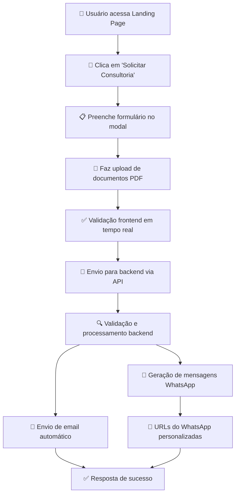

# 🏢 Aporte Capital - Landing Page Profissional

> **Landing page moderna e responsiva para empresa de aportes financeiros, com sistema completo de consultoria e geração automática de mensagens WhatsApp.**

[](https://nodejs.org/)
[](https://expressjs.com/)
[](LICENSE)
[]()

## 📋 Sobre o Projeto

A **Aporte Capital** é uma landing page profissional desenvolvida para empresas do setor financeiro que realizam aportes e investimentos. O projeto oferece uma experiência completa desde a apresentação dos serviços até o processo de solicitação de consultoria.

### 🎯 **Principais Diferenciais:**
- **Design Moderno**: Interface limpa e profissional
- **Sistema Duplo de WhatsApp**: Mensagens personalizadas para cliente e empresa
- **Gestão Inteligente de Documentos**: Upload seguro com links temporários
- **Responsividade Total**: Funciona perfeitamente em todos os dispositivos
- **Backend Robusto**: API completa com validações e segurança

## 🚀 Funcionalidades Principais

### 🎨 **Frontend Moderno**
- ✅ **Landing Page Responsiva**: Design adaptável para desktop, tablet e mobile
- ✅ **Modal de Consultoria**: Interface elegante com validação em tempo real
- ✅ **Upload Drag & Drop**: Sistema intuitivo para envio de documentos PDF
- ✅ **Animações Suaves**: Transições e efeitos visuais modernos
- ✅ **SEO Otimizado**: Meta tags e estrutura semântica

### ⚙️ **Backend Avançado**
- ✅ **API RESTful**: Endpoints organizados e documentados
- ✅ **Sistema de Email**: Envio automático com templates HTML
- ✅ **Validação CNPJ**: Consulta automática de dados empresariais
- ✅ **Gestão de Arquivos**: Upload seguro com limpeza automática
- ✅ **Links Temporários**: Acesso controlado aos documentos

### 📱 **Sistema WhatsApp Inteligente**
- ✅ **Mensagem para Cliente**: Sem link de download, orientações por email
- ✅ **Mensagem para Empresa**: Com link direto para download dos documentos
- ✅ **URLs Personalizadas**: Geração automática de links do WhatsApp
- ✅ **Formatação Profissional**: Mensagens estruturadas e informativas

## 🛠️ Tecnologias Utilizadas

### **Frontend**
-  **HTML5**: Estrutura semântica e acessível
-  **CSS3**: Flexbox, Grid, animações e responsividade
-  **JavaScript ES6+**: Interatividade e validações

### **Backend**
-  **Node.js**: Runtime JavaScript
-  **Express.js**: Framework web minimalista
-  **Multer**: Upload de arquivos
-  **Nodemailer**: Envio de emails

### **Ferramentas**
-  **Git**: Controle de versão
-  **NPM**: Gerenciador de pacotes

## 📋 Pré-requisitos

Antes de começar, certifique-se de ter instalado:

-  **Node.js** (versão 18 ou superior)
-  **NPM** (versão 8 ou superior)
- **Conta de Email**: Gmail recomendado para envio automático

## 🚀 Instalação e Configuração

### **1. Clone o Repositório**

```bash
# Clone o projeto
git clone https://github.com/seu-usuario/aporte-capital-landing.git

# Entre no diretório
cd aporte-capital-landing
```

### **2. Instale as Dependências**

```bash
# Instalar todas as dependências
npm install
```

### **3. Configure as Variáveis de Ambiente**

```bash
# Copie o arquivo de exemplo
cp .env.example .env
```

Edite o arquivo `.env` com suas configurações:

```env
# ===== CONFIGURAÇÕES DO SERVIDOR =====
PORT=3001
NODE_ENV=development

# ===== CONFIGURAÇÕES DE EMAIL =====
EMAIL_SERVICE=gmail
EMAIL_USER=seu-email@gmail.com
EMAIL_PASS=sua-senha-de-app-gmail

# ===== CONFIGURAÇÕES DE SEGURANÇA =====
JWT_SECRET=sua-chave-secreta-muito-segura

# ===== CONFIGURAÇÕES DE UPLOAD =====
MAX_FILE_SIZE=10

# ===== CONFIGURAÇÕES DE API =====
BASE_URL=http://localhost:3001
```

### **4. Configure o Gmail (Recomendado)**

Para usar o Gmail como provedor de email:

1. **Ative a verificação em duas etapas** na sua conta Google
2. **Gere uma senha de app**:
   - Acesse: [Google App Passwords](https://myaccount.google.com/apppasswords)
   - Selecione "App" → "Outro (nome personalizado)"
   - Digite "Aporte Capital Landing"
   - Use a senha gerada de 16 caracteres no `.env`

3. **Configure no arquivo `.env`**:
   ```env
   EMAIL_SERVICE=gmail
   EMAIL_USER=seu-email@gmail.com
   EMAIL_PASS=abcd-efgh-ijkl-mnop  # Senha de app de 16 caracteres
   ```

### **5. Inicie o Servidor**

```bash
# Desenvolvimento (com auto-reload)
npm run dev

# Ou produção
npm start
```

🎉 **Pronto!** Acesse: [http://localhost:3001](http://localhost:3001)

## 🎮 Como Usar

### **💻 Desenvolvimento Local**

```bash
# Iniciar em modo desenvolvimento
npm run dev

# Ou iniciar normalmente
npm start
```

**Acesse:** [http://localhost:3001](http://localhost:3001)

### **🌐 Funcionalidades Disponíveis**

1. **Landing Page**: Apresentação dos serviços da empresa
2. **Modal de Consultoria**: Formulário completo com validações
3. **Upload de Documentos**: Drag & drop para arquivos PDF
4. **Sistema WhatsApp**: Geração automática de mensagens personalizadas
5. **Email Automático**: Envio com templates profissionais

### **🚀 Deploy em Produção**

#### **Opção 1: Plataformas Cloud (Recomendado)**

**Vercel, Railway, Render, Heroku:**

```bash
# 1. Configure as variáveis de ambiente na plataforma:
NODE_ENV=production
EMAIL_USER=seu-email@gmail.com
EMAIL_PASS=sua-senha-de-app
PORT=3001

# 2. Faça o deploy
git push origin main
```

#### **Opção 2: VPS/Servidor Próprio**

```bash
# 1. Clone no servidor
git clone https://github.com/seu-usuario/aporte-capital-landing.git

# 2. Instale dependências
npm install --production

# 3. Configure .env para produção
NODE_ENV=production

# 4. Inicie com PM2 (recomendado)
npm install -g pm2
pm2 start server.js --name "aporte-capital"
```

## 📁 Estrutura do Projeto

```
aporte-capital-landing/
├── 📄 index.html              # Landing page principal
├── 🎨 styles.css              # Estilos CSS modernos
├── ⚡ script.js               # JavaScript frontend
├── 🔧 server.js               # Backend Node.js + Express
├── 📦 package.json            # Dependências e scripts
├── 📋 package-lock.json       # Lock de dependências
├── 📖 README.md               # Documentação (este arquivo)
├── 🔒 .env.example            # Template de variáveis
├── 🚫 .gitignore              # Arquivos ignorados pelo Git
├── 🖼️ images/                 # Imagens e assets
│   ├── logo.svg
│   ├── hero-image.svg
│   └── *.jpg, *.png
└── 📁 uploads/                # Arquivos temporários (ignorado)
    └── *.pdf (temporários)
```

### **📋 Principais Arquivos**

| Arquivo | Descrição |
|---------|-----------|
| `index.html` | Landing page responsiva com modal de consultoria |
| `styles.css` | Estilos CSS3 com Flexbox, Grid e animações |
| `script.js` | JavaScript ES6+ para interatividade e validações |
| `server.js` | Backend completo com API RESTful |
| `.env.example` | Template de configuração de ambiente |
| `.gitignore` | Proteção de arquivos sensíveis |

## 🎯 Como Funciona

### **🔄 Fluxo Completo da Aplicação**



### **📱 Sistema WhatsApp Inteligente**

O sistema gera **duas mensagens diferentes**:

#### **🎯 Para o Cliente (Sem Link)**
```
🏢 APORTE CAPITAL - Solicitação Recebida

Olá [Nome]! 

Recebemos sua solicitação de consultoria.
📧 Os documentos serão enviados por email
⏰ Prazo de análise: 24-48h
📞 Entraremos em contato em breve

Dados enviados:
• Empresa: [Nome da Empresa]
• Tipo: [Tipo de Consultoria]
• Valor: [Valor Solicitado]
```

#### **🏢 Para a Empresa (Com Link)**
```
🚨 NOVA SOLICITAÇÃO - APORTE CAPITAL

📋 DADOS DO SOLICITANTE:
• Nome: [Nome Completo]
• Email: [Email]
• Telefone: [Telefone]
• Empresa: [Nome da Empresa]

💼 DETALHES DA CONSULTORIA:
• Tipo: [Tipo]
• Valor: [Valor]
• Prazo: [Prazo]

📎 DOCUMENTOS: [Link para Download]

⚡ AÇÕES NECESSÁRIAS:
• Analisar documentos anexos
• Verificar dados da empresa
• Entrar em contato em 24h
```

## 📧 Sistema de Email Profissional

### **📨 Template HTML Responsivo**
- Design profissional com logo da empresa
- Formatação elegante dos dados
- Anexos PDF automáticos
- Compatível com todos os clientes de email

### **📋 Conteúdo do Email**
- ✅ Dados completos do solicitante
- ✅ Detalhes da consultoria solicitada
- ✅ Documentos PDF anexados
- ✅ Data e hora da solicitação
- ✅ Informações de contato

## 🔒 Segurança e Proteção

### **🛡️ Validações de Segurança**
- ✅ **Tipos de Arquivo**: Apenas PDF permitido
- ✅ **Tamanho Máximo**: 10MB por arquivo
- ✅ **Sanitização**: Limpeza de dados de entrada
- ✅ **CORS**: Configurado para domínios específicos
- ✅ **Rate Limiting**: Proteção contra spam

### **🔐 Proteção de Dados**
- ✅ **Arquivos Temporários**: Remoção automática após envio
- ✅ **Links Temporários**: Expiração automática em 24h
- ✅ **Variáveis de Ambiente**: Credenciais protegidas
- ✅ **Logs Seguros**: Sem exposição de dados sensíveis

### **🚫 Arquivos Protegidos (.gitignore)**
- ✅ Credenciais (`.env`)
- ✅ Uploads de clientes (`uploads/`)
- ✅ Dependências (`node_modules/`)
- ✅ Logs e arquivos temporários

## 🛠️ Personalização e Customização

### **🎨 Alterar Cores e Estilos**

Edite as variáveis CSS no arquivo `styles.css`:

```css
:root {
    /* Cores principais */
    --primary-color: #3b82f6;        /* Azul principal */
    --primary-light: #dbeafe;        /* Azul claro */
    --secondary-color: #1f2937;      /* Cinza escuro */
    --accent-color: #10b981;         /* Verde destaque */
    
    /* Tipografia */
    --font-primary: 'Inter', sans-serif;
    --font-size-base: 16px;
    
    /* Espaçamentos */
    --spacing-xs: 0.5rem;
    --spacing-sm: 1rem;
    --spacing-md: 1.5rem;
    --spacing-lg: 2rem;
}
```

### **📝 Modificar Campos do Formulário**

1. **HTML** (`index.html`): Adicione/remova campos no modal
2. **JavaScript** (`script.js`): Atualize validações
3. **Backend** (`server.js`): Ajuste processamento

### **📧 Configurar Outros Provedores de Email**

```javascript
// No server.js - Exemplo para Outlook/Hotmail
const emailConfig = {
    service: 'hotmail',
    auth: {
        user: 'seu-email@outlook.com',
        pass: 'sua-senha'
    }
};

// Ou configuração SMTP personalizada
const emailConfig = {
    host: 'smtp.seudominio.com',
    port: 587,
    secure: false,
    auth: {
        user: 'contato@seudominio.com',
        pass: 'sua-senha-segura'
    }
};
```

## 📜 Scripts NPM Disponíveis

```bash
# Iniciar servidor em desenvolvimento
npm run dev

# Iniciar servidor em produção
npm start

# Instalar dependências
npm install

# Instalar apenas dependências de produção
npm install --production

# Verificar vulnerabilidades
npm audit

# Corrigir vulnerabilidades
npm audit fix
```

## 🐛 Solução de Problemas

### **❌ Problemas Comuns**

| Problema | Causa Provável | Solução |
|----------|----------------|---------|
| 🚫 **Erro de Email** | Credenciais incorretas | Verifique `.env` e senha de app |
| 📎 **Upload falha** | Arquivo muito grande | Máximo 10MB por PDF |
| 🔒 **Modal não abre** | JavaScript não carregou | Verifique console do navegador |
| 🌐 **Servidor não inicia** | Porta ocupada | Altere `PORT` no `.env` |
| 📧 **Email não chega** | Filtro de spam | Verifique pasta de spam |

### **🔍 Debug e Logs**

```bash
# Ver logs do servidor
npm start

# Debug detalhado (se configurado)
DEBUG=* npm start

# Verificar status do PM2 (produção)
pm2 status
pm2 logs aporte-capital
```

### **🆘 Suporte Técnico**

1. **Console do Navegador**: `F12` → Console
2. **Logs do Servidor**: Terminal onde rodou `npm start`
3. **Arquivo de Log**: Verifique pasta `logs/` (se existir)
4. **Documentação**: Consulte docs das dependências

## 🤝 Contribuição

Contribuições são bem-vindas! Para contribuir:

1. **Fork** o projeto
2. **Clone** seu fork: `git clone https://github.com/seu-usuario/aporte-capital-landing.git`
3. **Crie uma branch**: `git checkout -b feature/nova-funcionalidade`
4. **Commit** suas mudanças: `git commit -m 'Adiciona nova funcionalidade'`
5. **Push** para a branch: `git push origin feature/nova-funcionalidade`
6. **Abra um Pull Request**

### **📋 Diretrizes de Contribuição**

- ✅ Siga os padrões de código existentes
- ✅ Adicione comentários em português
- ✅ Teste suas alterações localmente
- ✅ Atualize a documentação se necessário
- ✅ Mantenha commits pequenos e descritivos

## 📄 Licença

Este projeto está licenciado sob a **MIT License**.

```
MIT License

Copyright (c) 2025 Aporte Capital

Permission is hereby granted, free of charge, to any person obtaining a copy
of this software and associated documentation files (the "Software"), to deal
in the Software without restriction, including without limitation the rights
to use, copy, modify, merge, publish, distribute, sublicense, and/or sell
copies of the Software, and to permit persons to whom the Software is
furnished to do so, subject to the following conditions:

The above copyright notice and this permission notice shall be included in all
copies or substantial portions of the Software.
```

## 🏆 Créditos e Agradecimentos

- **Desenvolvido por**: Equipe de Desenvolvimento
- **Design**: Interface moderna e responsiva
- **Tecnologias**: Node.js, Express, HTML5, CSS3, JavaScript ES6+
- **Inspiração**: Melhores práticas de UX/UI para landing pages

---

<div align="center">

**🚀 Desenvolvido com ❤️ para Aporte Capital**

[](https://github.com/seu-usuario/aporte-capital-landing)
[](https://linkedin.com/company/aporte-capital)

**⭐ Se este projeto foi útil, considere dar uma estrela!**

</div>